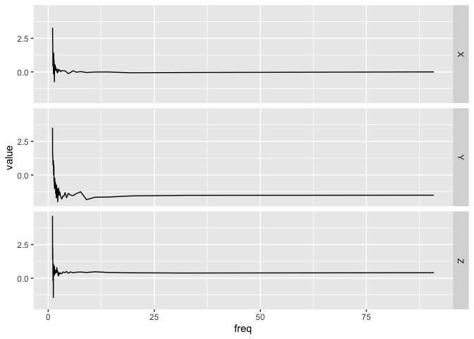

<!-- README.md is generated from README.Rmd. Please edit that file -->

# bis620.2022

<!-- badges: start -->

[](https://github.com/nokkvidan/bis620.2022/actions/workflows/R-CMD-check.yaml)
[](https://github.com/nokkvidan/bis620.2022/actions/workflows/test-coverage.yaml)
[](https://github.com/nokkvidan/bis620.2022/actions/workflows/lint.yaml)
[](https://codecov.io/gh/nokkvidan/bis620.2022)
<!-- badges: end -->

The goal of `bis620.2022` is to create an accelerometry graphic for a
dataset with time and three-dimensional coordinates. Additionally, it
has a feature for creating spectral signature plots. The plot function
creates an acceleration plot using a dataframe with either a frequency
column or a time column and X, Y, and Z variables. The spectral function
conducts quick discrete Fourier analysis on a dataframe.

The dataset `ukb_accel` from UKBiobank is part of the package and is
available for use in examples as seen here below in the example section.

### Badge overview

[Coverage page](https://app.codecov.io/gh/nokkvidan/bis620.2022)

[Lint
results](https://github.com/nokkvidan/bis620.2022/actions/workflows/lint.yaml)

## Installation

You can install the development version of bis620.2022 from
[GitHub](https://github.com/nokkvidan/bis620.2022) with:

``` r
# install.packages("devtools")
devtools::install_github("nokkvidan/bis620.2022")
```

## Example

Here is an example to use the bis620.2022 package to visualize the data
at hand:

``` r
library(bis620.2022)

# Call of UKBiobank accelerometry data
data(ukb_accel)

# Use Data
ukb_accel[1:100, ] |>
  # Use fourier w. log
  spectral_signature(take_log = TRUE) |>
  # Use plot
  accel_plot()
```


